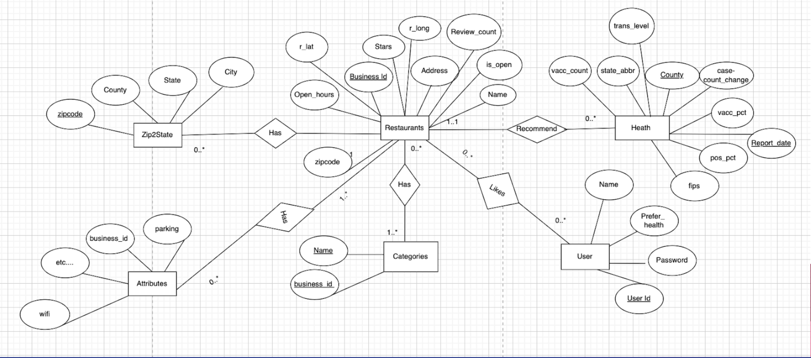

# [CIS550 Group Project] YYDX:  Treat your life even in pandemic
Yongxin Xu, Haolin Ye, Mudan Chen, Xiaozhe Yang (Group17)

## 1. Title
This web application is named “YYDX”. The name of this application is made up of the abbreviations of the names of our four creators, and the meaning in Chinese is: always do the best. 
## 2. Introduction
We are food lovers and enjoy dining out. While excited about hearing many restaurants are resuming, we all hope to know which area is less affected by COVID-19, This is exactly what our application solves. 

This project helps people to better understand the safety level in terms of covid-19 of the neighborhood. It incorporates the yelp dataset of restaurants from Kaggle, all counties’ COVID case data from CDC as well as vaccination data. Our recommendation algorithm is very unique since we constructed our own health indices. The health indices are based on five parts, number of covid cases, vaccination ratio, normalized stars, normalized number of reviews, and cross term of reviews and stats.

### 2.1 Web Application Functionality

- Home Page:

The home page consists of two sections: search restaurant and today's recommendations. Search restaurant section contains a search bar that requires users to type in their city.

Today’s recommendations section displays lists of 5-star restaurants of five different categories in the areas that are the least affected by the pandemic without any searching required

- Search Result Page:

The search result page displays the restaurants that are in a given city. Pagination is applied here, so each page would display 16 restaurants, and users need to click on the next button to look for more. 

- Sign In/Sign Up Page:

Our app supports user authentication, which requires a unique user name and a password that is stored in the database after hashing. Both Sign In and Sign Up accept 3-party authentication of Facebook and Google.

- Restaurant Details Page:

As its name suggests, this page displays detailed information about a restaurant. It is comprised of three sections: basic info,
COVID statistics, and map. 

- Collection Page:

This page shows all the restaurants liked by an authenticated user. It includes the basic information of each restaurant.

- Health Page:

Users may take a glance at the statistics describing the pandemic situation of a state by searching a state’s abbreviation of their interests. 

- Explore Page:

Users can explore nine other categories besides restaurants for activities: shopping, beauty & spas,  health & medical, nightlife, hair salons, arts & entertainment, nail salons, professional services, and gyms.

- About Us Page:

This page is informative. It describes the basic idea and highlighted features of the application. It also contains a FAQs section, which introduces our search algorithm, data sources, methods of query optimization, division of work, and the story behind the app name.

## 3. Architecture and Technologies Used
Our project has a client-server architecture. We used React.js for the client-side, and the Express.js framework for the server-side. Choices of databases are AWS RDS MySQL and MongoDB.

For the frontend, we applied a React UI template (https://treact.owaiskhan.me/), CanvasJS React Charts, and MUI for styling, and incorporated Google Map to display restaurant locations. For the backend, we applied mysql node.js driver to run our SQL queries, mongoose to model our NoSQL data. We use Passport.js to implement authentication. We also used 3-party packages to handle Facebook and Google authentication.

## 4. Data

### 4.1 Restaurant  Data
This dataset found on Kaggle is from Yelp Open Dataset, available as a JSON file. It contains information about restaurants as shown in Yelp, which includes location, rating, and category useful for restaurant recommendations. After cleaning, we have 120974 rows in the dataset.

Link: https://www.kaggle.com/fireballbyedimyrnmom/yelp-dataset?select=business.json 

### 4.2: Covid Data and Vaccination Data

The COVID-19 case database includes patient-level data reported by U.S. states and autonomous reporting entities, including New York City and the District of Columbia (D.C.), as well as U.S. territories and affiliates. And the vaccination dataset includes a daily report of vaccination status in each county. We join them together to represent the health condition in each county. After cleaning,  it finally contains 10 columns. The total number of rows in this dataset is 241874.  

Link1: https://covid.cdc.gov/covid-data-tracker/#trends_dailycases

Link2:
https://covid.cdc.gov/covid-data-tracker/#county-view|Vaccinations|Administered_Dose1_Pop_Pct|all

## 5. Database Design

### 5.1 Preprocessing
All the restaurant data were initial in one big table, we first cleaned them by dropping rows with Nulls, non-related data and reformatting them into separate tables. Then we mapped related attributes through one-hot encoding with labels 1 and 0. For the health dataset, we only use data from 2021/08/16 to 2021/11/01. To generate our Health dataset, we joined the vaccination data and the covid case data on fips codes. We also deleted some irrelevant columns. 			
### 5.2 ER Diagram
We have 7 entities including Restaurants, Health, Attributes, Categories, Users and Likes, Zip2State

### 5.3 Schema Design

Restaurants(business_id, name, address,stars, review_count, is_open, hours , r_lat, r_long, zipcode)

Zipcode2State(zipcode, county, city, state)

Health( county, report_date,fips, case_count_change, pos_pct, trans_level, state_abbr, vacc_pct, vacc_count)

Users(user_id, username, password, prefer_health)

Attributes(business_id, good_for_kids, takeout, garage, street, lot, valet….)

Likes(user_id, business_id) 

Categories(business_id, category)

### 5.4 Normal Forms
Here we list all functional dependencies in each relation:

- Restaurants

bus_id  → name, address,stars, review_count, is_open, hours , r_lat, r_long, zipcode
- Zipcode2State

Zipcode→county, city, state
- Health 

county,report _date → state_abbr, fips,case_count_change, pos_pct, translevel,vacc_pct, vacc_count
- Users

User_id → username, password, prefer_health
- Attributes

business_id → good_for_kids, takeout, garage,street, lot,valet… (all attributes)
- Likes

user_id → business_id
- Categories

business_id → category

It is in BCNF form since for every X→A, X is the key, and thus it is also 3NF

## 6. Queries & Main Features
We created a total of 16 endpoints and set up a route for each endpoint in our server. 
In this section, we will focus on the 5 most representative and complex queries from our application, and show where they are used and how they are implemented. The source code is attached in Appendix.

- Query1: search

The main function of our website is to search the restaurants. With the user's specification about the city, Our website will recommend the restaurants in that city for the user with the appropriate ranking of restaurants. Our ranking algorithm takes stars, number of reviews, and covid index into account. We use the min-max regularization to combine those three elements with appropriate weights to ensure each of them contribute to the ranking appropriately.

- Query2: getRestInfo

For every restaurant in the search page, by clicking the more details button, the website will direct to the page of the restaurant. It shows specific details about that restaurant. For example, its open hours, category, and other attributes.

- Query3: todayrecommendation/explore

We recommend restaurants of the top 5 most popular categories to users and they can choose how many restaurants they want to see. This query returns selected restaurants with their name, address information and the covid transmission level. Those restaurants’ latest transmission levels are not high, which means they are safer than other restaurants.  And they are all 5 stars with most  reviews, which means they are popular. In the explore page, users can explore other life entertainments. The recommendation logic is the same as today’s recommendation query, except the stars of those businesses are 4 and 5.

- Query4: stateinfo

This query called the stateinfo filters out all the restaurants in a user-input state and we categorize it based on its number of different categories, its vaccination level and its relative positive rate within the state.

Query5：getLikedRest
This query returns the current user's list of liked restaurants. It has fields including basic information about those restaurants and their covid status.

## 7. Performance Evaluation

#### 7.1 Before and After Optimization Comparison

|Query|Time Before |Time After |Method Used|
|-----|-----------|-----------|-----------|
|1: search|~2.7sec|~1.8sec|Push selection|
|2: getRestInfo|~1.1sec|~0.8sec|Push selection
|3: today recommendation/explore|~10sec|~1.3sec|Indexing on category, Push selection, Restructuring
|4: stateinfo|~4.3sec|~1.8sec|Indexing on category, projection
|5: getLikedRest|~1.2sec|~0.8sec|Push selection, Restructuring

### 7.2 Optimization Step:
- Query1: 
Push selection to reduce the number of tuples.

- Query2:
Push selection to reduce the number of tuples.

- Query3: 
1) Remove unnecessary fields in each intermediate table, for example, category and photo and then join this table with other tables. 
2) Using the left join and always let the smaller table be the outer table. In this query, table2 is the smallest, so we use table2 as the outer. 
3) Using index. We find that there are only 1500+ distinct categories, and we need to group by categories in table1, so we create index categories on Categories(category). 
- Query4: 
1) Remove unnecessary fields in each intermediate table.
2) Caching. We maintain an in-memory cache in route.js for this query. The cache maintains a mapping from states that users input to the query result. If there is a cache hit in the server, then we directly return the result without querying the database again.
Query5:
Push selection to reduce the number of tuples. 

## 8. Technical Challenges
1) Using google map: Implementation of google map and correctly locate the restaurants (eg. a same store in different State)
2) Deal with Huge Dataset: There are more than a thousand of different categories, and our dataset includes not only restaurants but other stores such as barber store as well, we had to filter it based on category to find restaurants only. 
3) Data preprocessing: the initial is data is complicated in nested dictionaries, one challenge is to flatten the dictionary and apply one-hot encoding
4) Construct Covid Safety index
Using min-max regularization algorithm to scale the data so that it can be incorporated into the restaurant recommendation with other index.

## 9. Extra Credit
For extra credits, we implemented these features:

1. MongoDB: In addition to SQL, we fetched queries from NoSql database on MongoDB Compass, specifically to retrieve data for two of the line charts on the Restaurant Detail Page 

2. Google and Twitter Sign In: In addition to User Sign-in register on our website, we also support third-party authentication from Facebook and Google 

3. Google Map: For each restaurant, in addition to retrieving information through queries, we also implemented a functionable google map that can be toggled/zoomed-in&out and with a marker pointing to the restaurant and showing directions 
